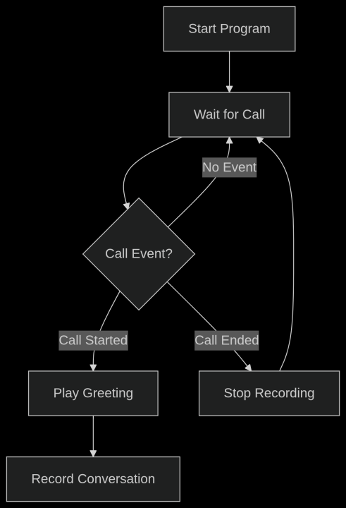
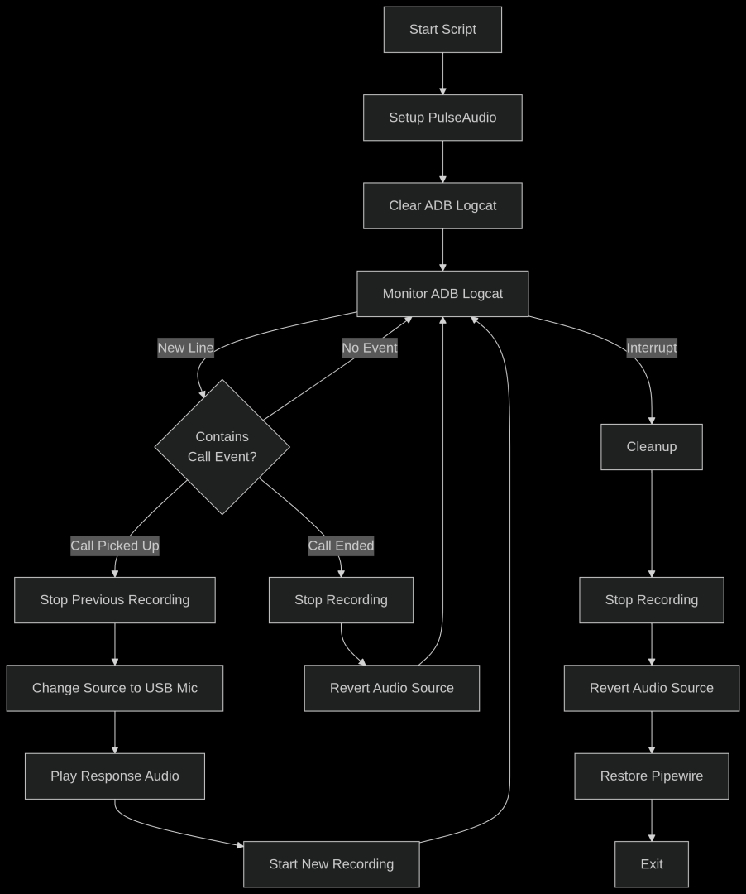

# LLM accessibility for farmers

- [X] 1st week progress:
## Discussion
[Minutes of Discussion](docs/Minutes-of-Discussion/README.md)

## Research Results
[Indian Languages Translation Model](docs/Translate-100-languages)

[Text To Speech Model](docs/Text-To-Speech-Unlimited)

## Call Response Interface Demo:
<video src="https://github.com/user-attachments/assets/35e05298-a1ef-47f5-a2ea-d81375fa492e" style="max-width: 100%;">Demo Video</video>

## Logic Flow


## Code Flow


## How to reproduce call response interface
### Requirements: Ubuntu system with PulseAudio, Android device
### Steps:
1. To connect ubuntu as handsfree, [follow this](https://askubuntu.com/a/1512854)
2. Uninstall pipewire [instructions](https://askubuntu.com/a/1441491) and restart ubuntu when done
3. Connect to ubuntu device on android via bluetooth, it shoud appear as an audio device
4. Clone Repository
5. Connect android device to ubuntu system via usb cable, Enble USB Debugging in developer options
6. Open a terminal in the Desktop folder of the cloned repo
7. Create a folder named CallRecordings (```mkdir CallRecordings```)
8. Run ```./call_handler.sh```
9. Now calls on the connected android device should play an audio message and save caller voice message in the CallRecordings folder

- [ ] Week 2 Core Infrastructure
  - Text, Image, Voice query system via JioChat
  - Pre-trained LLM and language translation
  - Speech language detection for language translation model
  - Basic speech-to-text and text to speech
  - Integration of all models
  - Testing via API Gateway
- [ ] Week 3 AI & Knowledge
  - Integrate API gateway with call and sms response interface
  - FAQ database for common farming questions
  - Simple caching system
- [ ] Week 4 User Experience
  - Set up all Indian agricultural products' information database
  - Image classification into agricultural products for Image queries
  - Integration (Fetch product information after image classification)
- [ ] Week 5 Pilot Launch
  - Basic analytics tracking
  - User documentation
  - System monitoring
  - Feedback collection
- [ ] Week 6 Buffer Week
