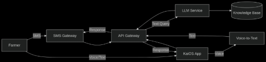
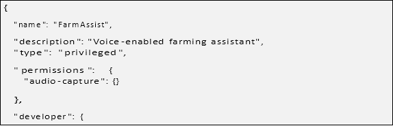

Team-7B

Problem Statement: Enabling easy LLM access to Farmers and those unfamiliar with Modern Tech

1\. Prajwal Warade - <prajwal8074@gmail.com> -  7990558265

2\. Aditya Sosa - <adityakumarsosa@gmail.com> - 8347815915

3\. V. Akash - <u22ee107@eed.svnit.ac.in> - 9629724266

4\. Shubham Malviya - <shubhammalviya2005@gmail.com> - 9157434036 

5\. Sandip Dalvi - <dalvisandip336@gmail.com> - 7859821560

Minutes of Discussion:

01/06/2025

Discussion of problem statement,

Annam AI Team 7B – IIT Ropar

Minutes of Meeting

Meeting Title: Discussion of problem statement

Date: June 1, 2025

Mode: Online

Attendees:

• Prajwal Warade

• Aditya Kumar Sosa

• V Akash

• Shubham Malviya

• Dalvi Sandip 

**Agenda and Discussion Points:**

**1. Welcome and Introduction**

• This was the first meet of the Team 7B following its recent formation.

• All members of the team were self-introduced.

**2.Problem statements were discussed as follows:**

**Proposals:**

- Soil Health – Predictive and diagnostic tools using AI
- Smart Irrigation – Optimizing water usage through ML models
- Pest Management – Real-time monitoring and AI-based identification
- Crop Monitoring – AI tools for growth analysis and yield prediction
- Post-Harvest Systems – Enhancing storage, logistics, and supply chain using tech
- Water improvement for farms livestock and fisheries
- Automation for cleaning and packaging for fish products
- AI-Powered Information Access for Indian Farmers via SMS through KaiOS

**3.Mode of Internship was concluded as online.**

**4.The two problem statements were taken after discussion** 

- AI-Powered Information Access for Indian Farmers via SMS through KaiOS
- Water improvement for farms, livestock and fisheries

**5.Coordinated for the next event date.**

**Explanation of the chosen problem statement.**

**Water Quality Assessment and Improvement for Indian Farms Using AI**

In India, water quality for agriculture can vary significantly—even between neighboring farms—due to factors like underground water sources, soil composition, and regional climate variations. This inconsistency affects crop health and yield, making it essential for farmers to understand whether their available water is suitable for growing specific crops.

A major concern in water quality is salt content, which, if too high, can damage crops. While some traditional methods like soil flushing can reduce salinity, these are often temporary and not always cost-effective. For optimal results, farmers need to reduce the salt content in irrigation water to safe levels—ideally below 800 ppm—before or during critical farming seasons such as Rabi and Kharif.

Farmers also need guidance on selecting safe and affordable chemicals or natural methods to treat water without harming their crops. Unfortunately, much of this information is scattered or difficult to access. This is where Artificial Intelligence (AI), specifically Large Language Models (LLMs), can play a transformative role. AI tools can help farmers quickly identify suitable treatments and practices tailored to their water composition, crop type, and local conditions—reducing both economic and environmental costs.

In addition to salinity, other water quality factors like pH level and mineral content (magnesium, copper, phosphorus, iron, etc.) are crucial. These minerals, while often absent in soil, can be dissolved in water and absorbed more efficiently during irrigation. In fact, applying nutrients through water improves absorption by up to 98%, compared to just 40% when applied directly to the soil through spraying.

Water quality is also critical for livestock and aquaculture. Different animals and fish species have specific water requirements. For example:

- Freshwater fish require very low salt concentrations.
- Saltwater fish need stable saline conditions.
- Livestock require water that is free from contaminants, heavy metals, and pathogens.

Clean and balanced water not only ensures animal health but also improves the quality of produce (milk, meat, fish), contributing to a healthier food supply chain.

Our team believes that water, being an essential resource for plants, animals, and humans alike, should be prioritized in efforts to improve agricultural productivity. By leveraging AI and LLMs, we aim to empower farmers with actionable insights to improve water quality, enhance crop and livestock outcomes, and ultimately increase farm profitability with minimal environmental impact.

**1. Electrical Conductivity (EC) Sensor / TDS Sensor**

- Purpose: Measures salinity or salt content (Total Dissolved Solids - TDS).
- Recommended Sensor:
  - DFRobot Gravity Analog TDS Sensor
  - SEN0244 TDS Sensor
- Why: Essential for identifying if salt levels are too high for crops or freshwater fish.

![ref1]

**2. pH Sensor**

- Purpose: Measures the acidity or alkalinity of water.
- Recommended Sensor:
  - DFRobot Gravity: Analog pH Sensor V2
  - Atlas Scientific pH Sensor Kit
- Why: Different crops and animals need water within specific pH ranges (e.g., 6.0–7.5 for most crops).

![ref1]

**3. Turbidity Sensor**

- Purpose: Measures suspended solids or clarity of water.
- Recommended Sensor:
  - TSD-10 Turbidity Sensor
  - DFRobot SEN0189 Turbidity Sensor
- Why: Indicates water contamination (important for livestock and aquaculture).

![ref1]

**4. Dissolved Oxygen (DO) Sensor**

- Purpose: Measures the amount of oxygen dissolved in water.
- Recommended Sensor:
  - Gravity Analog Dissolved Oxygen Sensor
- Why: Crucial for fisheries—low DO can kill fish.

![ref1]

**5. Temperature Sensor**

- Purpose: Measures water temperature.
- Recommended Sensor:
  - DS18B20 Waterproof Temperature Sensor
- Why: Temperature affects pH, DO, and overall suitability for crops and aquatic life.

![ref1]

**6. ORP (Oxidation-Reduction Potential) Sensor**

- Purpose: Measures the water’s ability to break down contaminants.
- Recommended Sensor:
  - Atlas Scientific ORP Probe
- Why: Helps in understanding water sterilization potential—important for livestock and fish.

![ref1]

**7. Ion-Selective Electrodes (ISE) for Minerals** 

- Purpose: Measures specific ions like magnesium, calcium, nitrate, etc.
- Recommended Sensor:
  - ISE Probes from Vernier or Atlas Scientific
- Why: by Ideal for precision farming and nutrient management via irrigation.

![ref1]**Integration Tips**

- Use an Arduino, Raspberry Pi, or ESP32 for sensor interfacing.
- Combine with AI/LLM backend to:
  - Analyze readings
  - Recommend treatment actions (e.g., gypsum for salinity, acidifier for high pH)
  - Predict seasonal water quality changes

**AI-Powered Information Access for Indian Farmers via SMS and KaiOS**

**The** **Challenge** 

Many farmers in India lack access to smartphones and reliable internet, limiting their ability to receive crucial agricultural information. While feature phones and JioPhones are widely used for communication, sophisticated information services remain largely inaccessible.

**Our Solution**

We propose a two-pronged approach using widely available technologies:

- **LLM-powered SMS Service:** Farmers can ask questions in local languages via SMS and receive AI-generated responses.
- **KaiOS Application for JioPhone Users:** Dedicated app with **voice-to-text support**

  for low-literacy users. To be published via:

<https://developer.kaiostech.com/docs/distribution/submission-portal/>
# **Technical Architecture**

**Data Flow**
## SMS Query Path
- Farmer sends SMS query in local language
- SMS received by SMS Gateway (MSG91)
- Gateway forwards to API Gateway (AWS)
- Request Router directs to SMS Processor
- SMS Processor formats for LLM Service
- LLM processes query using local language NLP
- Response sent back through SMS Processor
- SMS Gateway delivers response to farmer

6

**Path:** Farmer *→* SMS Gateway *→* API Gateway *→* Request Router *→* SMS Processor *→* LLM

*→* Response *→* SMS Gateway *→* Farmer

## **KaiOS Voice Query Path**
1. Farmer speaks query into KaiOS app
1. App captures audio and sends to Voice-to-Text Service (Hybrid: Device processes simple commands, cloud handles complex queries)
1. Transcribed text sent to App Request Handler
1. Handler formats request for LLM Service
1. LLM processes query using local language NLP
1. Response returned to KaiOS app for display

**Path:** Farmer *→* KaiOS App *→* Voice-to-Text *→* App Request Handler *→* LLM *→* Response

*→* KaiOS App

## **KaiOS Text Query Path**
1. Farmer types query in KaiOS app
1. Text sent directly to App Request Handler
1. Handler formats request for LLM Service
1. LLM processes query using local language NLP
1. Response returned to KaiOS app for display

**Path:** Farmer *→* KaiOS App *→* App Request Handler *→* LLM *→* Response *→* KaiOS App

# Optimized Tech Stack

### Component	Technology	Rationale

7

KaiOS App

Backend

AI Services

Infrastructure

- Vanilla JS/HTML5/CSS
- ![ref2]KaiOS SDK
- Web Speech API Polyfill
- ![ref2]Node.js/Express
- PostgreSQL
- ![ref2]Redis
- TinyLlama (HF)
- Google Speech-to-Text

  ![ref2]

# **Key Implementation Details**
## **KaiOS App Development**
- **UI Framework:** Pure JavaScript (no React/Vue) for faster KaiStore approval
- **Voice Processing:** Hybrid approach:
  - On-device: Basic command recognition (Web Audio API)
  - Complex queries: Cloud processing (Google Speech-to-Text)
- **Storage:** IndexedDB for offline query caching
- **Distribution:** KaiStore submission portal with manifest:

{

" name ": " Farm Assist",

" description ": " Voice - enabled farming assistant", " type ": " privileged ",

" permissions ":   { " audio - capture ": {}

},

" developer ": {

" name ": " Your Organization ", " url": " https :// example . com "

}

}

## **SMS Service Optimization**
- **Message Compression:** Use custom abbreviations (e.g., #PRICE=TOMATO)
- **LLM Optimization:** Distilled TinyLlama model (200MB RAM usage)
- **Carrier Integration:** MSG91 for bulk SMS @ Rs.0.12/message

## **Acceleration Strategies**
- **Pre-trained Models:** Leverage AI4Bharat’s IndicBERT and IndicSpeech
- **Template Responses:** 40% common queries use cached answers
- ### Minimal Viable Features:
  - Phase 1: Q&A + price checks
  - Phase 2: Weather alerts (post-launch)

**Next Steps**

1. Finalize SMS provider
1. Collect regional crop/language datasets
1. Collect regional stores datasets
1. Begin TinyLlama fine-tuning (Week 1)

Minutes of Discussion:

04/06/2025

Discussion of problem statement,

Annam AI Team 7B – IIT Ropar

Minutes of Meeting

Meeting Title: Discussion of problem statement

Date: June 1, 2025

Mode: Online

Attendees:

• Dr. Ritesh Kumar

• Prajwal Warade

• Aditya Kumar Sosa

• V Akash

• Shubham Malviya

**1.Introduction the team members to the mentor.**

**2.Discussion and choosing of problem statements**

- Water quality improvement idea was rejected due to its large time taking nature and the use of PCB circuit design which can’t be completed in online mode.
- AI-Powered Information Access for Indian Farmers via SMS through KaiOS

**3.Improvement of the chosen idea**

- Integration of marketplace through inventory management with help of LLM
- What type of problems farmers normally face, list them and discussed them and create an faster response for it
- Don’t look for Apps, choose a suitable API

**4.Conclusion of the meeting.**

Minutes of Discussion:

01/06/2025

Discussion of problem statement,

Annam AI Team 7B – IIT Ropar

Minutes of Meeting

Meeting Title: Improvement of problem statement

Date: June 7, 2025

Mode: Online

Attendees:

• Prajwal Warade

• Aditya Kumar Sosa

• V Akash

• Shubham Malviya

• Dalvi Sandip 

**1.Idea Improvement** 

Addition of a toll free number for farmers who can’t access text messaging and answering them through toll free number.

Support of LLM for more than 15 majorly spoken languages in India

**2.Work Done**

- Initial AWS infrastructure setup for the SMS backend.
- Launched t4g.micro Ubuntu server
- PostgreSQL Database: farmer-db (Free Tier)
- Cluster: farmassist-cache (Redis 7.1)
- Basic Express server running on port 3000 (Connected to both RDS and Redis)
- Created the repository <https://github.com/adityasosa6040/SMS_LLM>

**3.Creation of the Prototype**

Explanatio given on github

**4.Preparation of the Report**

**Conclusion:**

The thought to tackle this problem statement 

In this developing India the people who are forgotten and can’t participate in this are the rural elderly who might be literate or illiterate.

So their major job is farming where we play a role in helping them reduce their burdens by being more informative and always responsive to everyone irrespective of the place and time.

Farming is vast subject it depends on so many factors that it is uncontrollable but can increase the factor of controllability by improving the methods.

11

[ref1]: Aspose.Words.57296e52-3341-4297-b24a-424579ccefe3.001.png
[ref2]: Aspose.Words.57296e52-3341-4297-b24a-424579ccefe3.006.png
